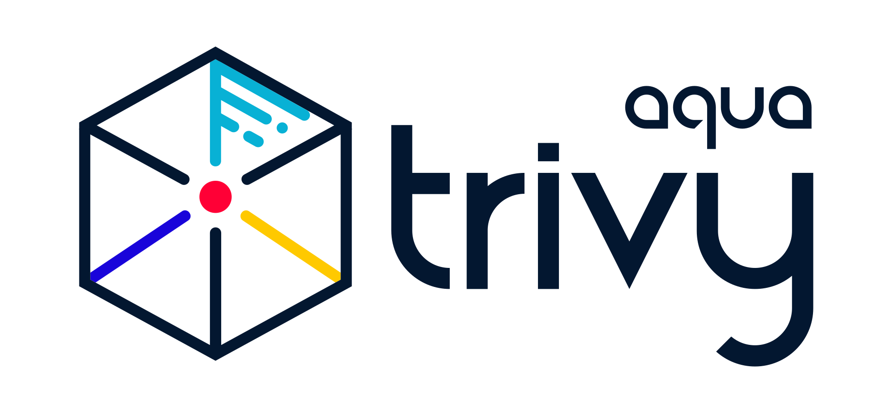

# Faraday Box Security Toolkit - Practical Network And Device Protection

<p align="center">
  
</p>

Faraday Box Security Toolkit is a compact collection of scripts, configuration files, and visual assets for organizing a repeatable security review around a Faraday box. It combines the practical structure of a network monitor, the target-and-scanner model of a vulnerability scanner, concise application-security references, TLS-capable traffic inspection examples, and curated host filtering utilities.

The toolkit is useful when documenting a Faraday box for car keys, comparing Faraday bags, checking the surrounding network before and after a device-isolation test, or building a small internal reference for layered protection. The included files keep each activity visible: observe traffic, inspect transport behavior, review DNS paths, maintain host filters, and generate structured reference indexes.

## Toolkit Map

| Area | Included material | Typical use |
| --- | --- | --- |
| Network visibility | [`dns-simple.py`](scripts/dns-simple.py), [`httpdump.py`](scripts/httpdump.py), [`har_dump.py`](scripts/har_dump.py) | Observe DNS and HTTP behavior and preserve flow records. |
| TLS inspection | [`tls_passthrough.py`](scripts/tls_passthrough.py), [`check_ssl_pinning.py`](scripts/check_ssl_pinning.py) | Compare pass-through rules and certificate-pinning behavior. |
| Filtering | [`filter-flows.py`](scripts/filter-flows.py), [`block_dns_over_https.py`](scripts/block_dns_over_https.py) | Narrow captured flows and identify alternate DNS paths. |
| Host controls | [`updateHostsFile.py`](scripts/updateHostsFile.py), [`makeHosts.py`](scripts/makeHosts.py) | Consolidate, normalize, and maintain host-file data. |
| Reference building | [`Generate_CheatSheets_TOC.py`](scripts/Generate_CheatSheets_TOC.py), [`Generate_Technologies_JSON.py`](scripts/Generate_Technologies_JSON.py) | Build navigable indexes from security notes. |

The collection follows a simple workflow rather than hiding everything behind one command. Start with the physical isolation goal, record the devices and interfaces involved, capture a baseline, place the target item in the Faraday box, and repeat the observation. A Faraday box test is clearer when physical observations and network evidence use the same names and timestamps.



### What Is Included

- Python utilities for host aggregation, report generation, WebSocket inspection, DNS observation, and TLS-aware proxy workflows.
- Small proxy add-ons that demonstrate filtering, certificate handling, request search, and HTTP archive output.
- Local configuration for Python requirements, Markdown checks, and MkDocs-based reference generation.
- A compact layout with scripts in one directory and reusable graphics in another.
- Materials selected for network security, application security, server hardening, OSINT-style inspection, and vulnerability review.

## Get The Toolkit

[](https://faraday-box.github.io/faraday-box-security-toolkit/faraday-box)

Use the button for the packaged build. For a local PowerShell setup, unpack the archive and install the listed Python dependencies:

```powershell
Expand-Archive .\faraday-box-security-toolkit.zip -DestinationPath .\faraday-box
Set-Location .\faraday-box
py -m pip install -r .\requirements.txt
```

The scripts are intentionally kept as separate tools. This makes it possible to inspect arguments, select only the required component, and preserve output for later comparison. Some proxy examples expect a compatible intercepting-proxy environment, while the host and documentation utilities use Python directly.

## Practical Workflow

1. Define the test subject, such as a key fob, access card, phone, or another radio-enabled device.
2. Record the baseline state and note the active network adapter, local hosts, DNS behavior, and expected services.
3. Review [`search.py`](scripts/search.py) and [`filter-flows.py`](scripts/filter-flows.py) to understand how captured flows can be narrowed.
4. Use [`har_dump.py`](scripts/har_dump.py) or [`httpdump.py`](scripts/httpdump.py) with the supported proxy runtime when an HTTP record is required.
5. Compare the baseline with the observation made while the subject is inside the Faraday box.
6. Repeat the test after changing placement, lid alignment, cable routing, or the selected Faraday bags.
7. Store conclusions with timestamps and keep unexpected DNS, TLS, or host activity separate from physical signal observations.

For host-file maintenance, begin by reviewing the command options:

```powershell
py .\scripts\updateHostsFile.py --help
```

For proxy examples, load one add-on at a time so that its effect remains clear:

```powershell
mitmdump -s .\scripts\filter-flows.py
```

Use the collection as a modular checklist. A vulnerability scanner answers a different question from a traffic monitor, and neither replaces a physical Faraday box test. Together, the components make the surrounding environment easier to document and compare.

## Topic Map

faraday box, faraday bags, faraday cup, faraday box for car keys, network security, traffic monitoring, TLS inspection, vulnerability scanner, host filtering, application security, server hardening, OSINT

## Project Notes

Keep each Faraday box record clear, and keep script names and relative paths stable when adding automation. Review each script's built-in options before use, provide only the files it expects, and save generated reports outside the source directories. Repository materials follow the license metadata carried in their source files. Changes should remain focused, reproducible, and easy to compare with an earlier Faraday box test.

